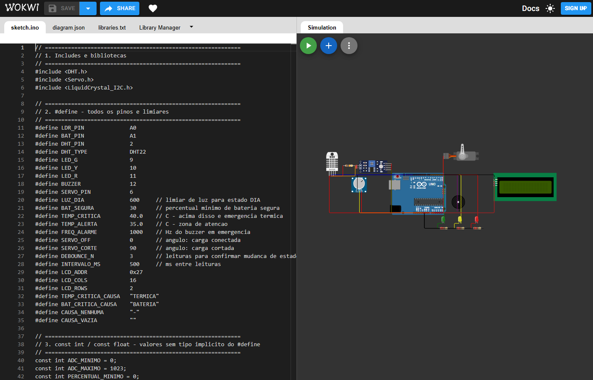

# AURORA — Sistema de Gestão Energética para Base Lunar

> "O código que mantém a luz acesa na noite mais longa."

## Em poucas palavras (para quem nunca viu o projeto)

Imagine uma base onde astronautas moram na Lua. Lá não há tomada na parede: toda a energia vem de painéis solares e fica guardada em baterias. Durante o longo dia lunar há luz de sobra; durante a longa noite, a base depende só da bateria. Se a bateria esvaziar ou se a temperatura disparar, vidas correm risco.

O **AURORA** é o "cérebro de segurança" dessa base. Ele fica o tempo todo de olho em três coisas — **quanta luz há**, **quanta bateria resta** e **qual a temperatura** — e decide automaticamente em qual de três situações a base está:

- 🟢 **DIA** — há luz solar, tudo tranquilo.
- 🟡 **NOITE** — está escuro, mas a bateria ainda aguenta.
- 🔴 **EMERGÊNCIA** — a bateria está baixa demais **ou** está quente demais. O sistema soa um alarme e corta a energia dos equipamentos não essenciais para proteger a base.

Como construir uma base lunar de verdade não é possível, tudo isso é montado e testado em um **simulador online gratuito chamado Wokwi**, que imita um computador de placa (Arduino) ligado a sensores e luzes na tela do seu navegador. Você não precisa comprar nada nem instalar nada para ver funcionando.

🔗 **Abra e veja rodando aqui:** [https://wokwi.com/projects/465189529004507137](https://wokwi.com/projects/465189529004507137)

---

## 1. Descrição do Projeto

AURORA é um sistema embarcado em **Arduino Uno** para monitorar energia, temperatura e umidade em uma base lunar simulada no Wokwi. O controlador classifica automaticamente o estado operacional em **DIA**, **NOITE** ou **EMERGÊNCIA** e aciona LEDs, buzzer, servo motor e display LCD conforme a situação da base. O projeto representa uma camada física de segurança para habitats lunares inspirados no contexto do programa **Artemis** (a iniciativa internacional de retorno do ser humano à Lua).

### O que você precisa saber antes de começar

Você **não precisa** saber programar nem ter experiência com eletrônica. Mas estes três termos aparecem o tempo todo:

| Termo | O que é, em linguagem simples |
|-------|-------------------------------|
| **Arduino Uno** | Um pequeno computador do tamanho de um cartão. Ele lê sensores e liga/desliga luzes, som e motores seguindo as instruções do nosso código. |
| **Wokwi** | Um site gratuito que simula esse Arduino e seus componentes na tela, sem precisar de peças físicas. É onde o projeto "ganha vida". |
| **Sensor** | Um componente que mede algo do mundo real (luz, temperatura) e entrega esse valor ao Arduino. |

Os "sensores" são controlados por você na tela, então é você quem simula o nascer e o pôr do sol, a bateria enchendo/esvaziando e a temperatura subindo.

## 2. Objetivo

O objetivo do AURORA é manter a operação mínima de uma base lunar mesmo durante variações de luz, bateria e temperatura. O sistema lê um LDR como simulação de painel solar, um potenciômetro como nível de bateria e um DHT22 como sensor ambiental. Quando há luz suficiente, a base opera em modo DIA; quando a luz cai, passa para NOITE se a bateria estiver segura; se a bateria ficar crítica ou a temperatura exceder o limite, entra em EMERGÊNCIA. Em emergência, o sistema alerta com buzzer, sinaliza com LED vermelho e move o servo para cortar cargas não essenciais.

## 3. Componentes Utilizados

| Componente | Função | Pino Arduino | Obrigatório |
|------------|--------|--------------|-------------|
| Arduino Uno | Controlador principal do sistema | - | Sim |
| LDR / Photoresistor | Simula luz solar/painel solar | A0 | Sim |
| Potenciômetro 10k | Simula nível da bateria em 0-100% | A1 | Sim |
| DHT22 | Mede temperatura e umidade da base | D2 | Sim |
| LED Verde | Indica estado DIA | D9 | Sim |
| LED Amarelo | Indica estado NOITE | D10 | Sim |
| LED Vermelho | Indica estado EMERGÊNCIA | D11 | Sim |
| Buzzer | Alarme sonoro em emergência | D12 | Sim |
| Servo Motor SG90 | Corte físico de carga não essencial | D6 | Sim |
| LCD I2C 16x2 | Display local de estado, bateria e sensores | A4/A5 | Sim |
| Resistor 10k | Pull-up do DHT22 | D2/5V | Sim |
| Resistores 220 ohms | Limitação de corrente dos LEDs | D9/D10/D11 | Sim |

## 4. Lógica de Estados

| Estado | Condição | LED | Buzzer | Servo | LCD/Serial |
|--------|----------|-----|--------|-------|------------|
| DIA | `luz > 600` e temperatura não crítica | Verde HIGH | OFF | 0 graus, carga conectada | Mostra `DIA` |
| NOITE | `luz <= 600`, `bateria >= 30%` e temperatura não crítica | Amarelo HIGH | OFF | 0 graus, carga conectada | Mostra `NOITE` |
| EMERGÊNCIA | `bateria < 30%` ou `temp > 40.0 C` | Vermelho HIGH | ON, 1000 Hz | 90 graus, carga cortada | Mostra `EMERGENCIA` e causa |

O código usa debounce de 3 leituras consecutivas antes de confirmar uma troca de estado, evitando oscilação visual quando os sensores ficam perto dos limites.

## 5. Como Executar no Wokwi (passo a passo)

> Não é preciso instalar nada. Basta um navegador (Chrome, Edge, Firefox) e o link do projeto.

### Ligando o sistema

1. **Abra o projeto:** clique em [AURORA no Wokwi](https://wokwi.com/projects/465189529004507137). A tela mostra, à esquerda, o código e, à direita, o circuito (a "maquete" eletrônica).
2. **Inicie a simulação:** clique no botão verde de **play** (▶ *Start Simulation*) acima do circuito. As bibliotecas necessárias já vêm configuradas no projeto — não precisa instalar nada manualmente.
3. **Aguarde o boot:** o display LCD mostra `AURORA v1.1 / Inicializando...` por alguns segundos e depois começa a exibir os dados.
4. **Abra o Serial Monitor:** é o painel de texto na parte de baixo. Ele funciona como o "diário de bordo" da base, mostrando estado, causa e leituras a cada ciclo. (Se pedir velocidade, use `9600 baud`.)

### Como simular cada situação

Os componentes do circuito são **interativos**: clique neles durante a simulação para mudar seus valores e ver a base reagir em tempo real.

| Quero testar... | O que fazer no circuito | O que deve acontecer |
|-----------------|-------------------------|----------------------|
| 🟢 **DIA** | Clique no **sensor de luz (LDR)** e arraste a luz para o nível alto (claro). | LED **verde** acende; LCD mostra `DIA`; servo na posição de carga conectada; buzzer em silêncio. |
| 🟡 **NOITE** | Escureça o **LDR** (luz baixa) **e** mantenha o **potenciômetro** (bateria) em **30% ou mais**. | LED **amarelo** acende; LCD mostra `NOITE`. |
| 🔴 **EMERGÊNCIA (bateria)** | Com a luz baixa, gire o **potenciômetro** para **abaixo de 30%**. | LED **vermelho** acende; **buzzer apita**; servo gira para cortar a carga; LCD mostra `EMERGENCIA`. |
| 🔴 **EMERGÊNCIA (temperatura)** | Clique no **sensor DHT22** e aumente a temperatura para **acima de 40 °C**. | Mesma reação acima — alarme e corte de carga, independente da luz/bateria. |
| ✅ **Normalizar** | Volte a bateria para **≥ 30%** e a temperatura para **abaixo de 40 °C**. | A base sai da emergência e volta para DIA ou NOITE conforme a luz. |

> 💡 **Por que às vezes demora ~1,5 s para mudar?** O sistema usa um *debounce* (ver Seção 4): ele exige 3 leituras seguidas confirmando a mudança antes de trocar de estado. Isso evita que a base fique "piscando" entre estados quando um sensor está exatamente no limite. É comportamento esperado, não travamento.

## 6. Demonstração em Vídeo e Screenshot

### Vídeo — simulação completa

https://github.com/GlobalSolution-Aurora-1ESPI/Aurora-Edge/blob/main/docs/demo-aurora.mp4

> O vídeo acima mostra o sistema completo funcionando: boot, estado DIA, NOITE, EMERGÊNCIA por bateria, EMERGÊNCIA por temperatura e normalização.

### Screenshot do circuito



## 7. Estrutura do Circuito

```text
Arduino Uno
├── A0  <- LDR / sensor de luz
├── A1  <- Potenciômetro da bateria
├── D2  <- DHT22 DATA + resistor pull-up 10k para 5V
├── D6  -> Servo motor SG90
├── D9  -> LED verde + resistor 220 ohms
├── D10 -> LED amarelo + resistor 220 ohms
├── D11 -> LED vermelho + resistor 220 ohms
├── D12 -> Buzzer
├── A4  -> SDA do LCD I2C
├── A5  -> SCL do LCD I2C
├── 5V  -> Alimentação dos sensores, LCD e atuadores
└── GND -> Terra comum do circuito
```

Arquivos principais do repositório:

| Arquivo | Descrição |
|---------|-----------|
| `AURORA.ino` | Código Arduino/C++ do controlador |
| `diagram.json` | Circuito Wokwi com Arduino, sensores, atuadores e LCD |
| `libraries.txt` | Bibliotecas usadas pelo simulador |
| `docs/screenshot-wokwi.png` | Screenshot do circuito AURORA no Wokwi |

## 8. Solução de Problemas (FAQ)

| Sintoma | Provável causa | O que fazer |
|---------|----------------|-------------|
| O circuito não se mexe / nada acende | A simulação não foi iniciada. | Clique no botão verde de **play** (▶) acima do circuito. |
| O LCD mostra quadradinhos ou nada | Endereço do display ou a simulação ainda no boot. | Aguarde alguns segundos após o play; se persistir, pare e reinicie a simulação. |
| O estado não muda mesmo mexendo no sensor | O *debounce* está confirmando a mudança. | Aguarde ~1,5 segundo (3 leituras). É o comportamento normal de estabilização. |
| O Serial Monitor está vazio | O painel não foi aberto ou está em baud errado. | Abra o **Serial Monitor** na parte inferior e use `9600 baud`. |
| O buzzer não para | A base continua em EMERGÊNCIA. | Normalize a bateria (≥ 30%) **e** a temperatura (< 40 °C). |

## 9. Glossário

| Termo | Significado em linguagem simples |
|-------|----------------------------------|
| **LDR (fotorresistor)** | Sensor de luz. No Wokwi, você arrasta um controle para simular mais ou menos luz solar. |
| **Potenciômetro** | Um botão giratório. Aqui ele simula o **nível da bateria** (0% a 100%). |
| **DHT22** | Sensor que mede **temperatura e umidade** do ambiente. |
| **LED** | Luz indicadora. Verde = DIA, amarelo = NOITE, vermelho = EMERGÊNCIA. |
| **Buzzer** | Uma pequena campainha que apita como **alarme** na emergência. |
| **Servo motor** | Um motorzinho que gira para uma posição exata. Aqui ele simula uma **chave física** que liga (0°) ou corta (90°) a energia dos equipamentos. |
| **LCD I2C 16x2** | Telinha de **16 colunas por 2 linhas** que mostra o estado e os dados da base localmente. |
| **Resistor** | Componente que limita a corrente elétrica, protegendo LEDs e sensores. |
| **Debounce** | Técnica que evita trocas falsas de estado: só muda após **3 leituras seguidas** confirmarem. |
| **Serial Monitor** | Painel de texto que funciona como o **diário de bordo**, registrando tudo que o sistema decide. |
| **Baud (9600)** | A velocidade de comunicação entre o Arduino e o Serial Monitor. Deve estar igual nos dois lados. |

## 10. Integrantes

| Nome Completo | RM |
|---------------|----|
| Bruno Carreiro Dos Santos | 569423 |
| Eduardo Bechara Medeiros Craveiro | 571081 |
| Gustavo Ferreira Tavares | 569928 |
| Gustavo Moita de Lima | 569180 |
| Felipe Rabelo | 570340 |
